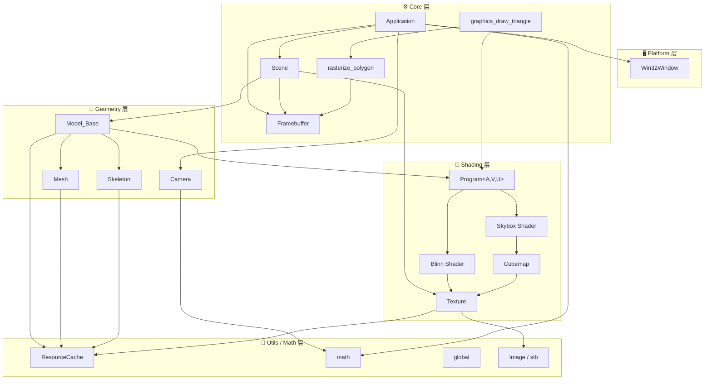
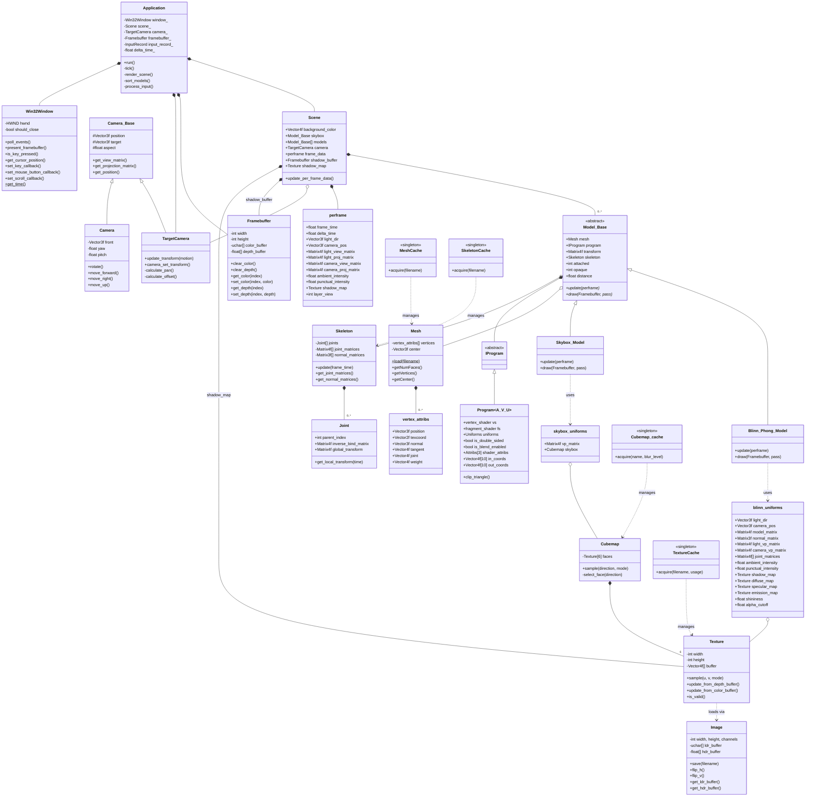
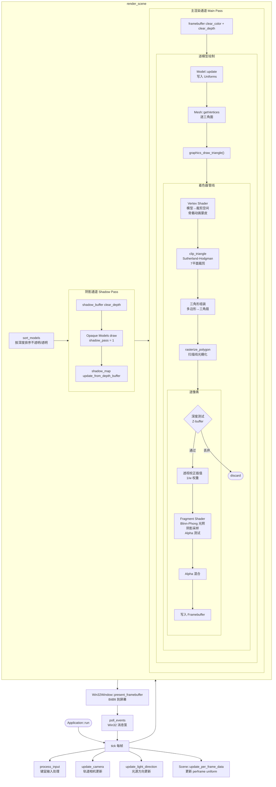
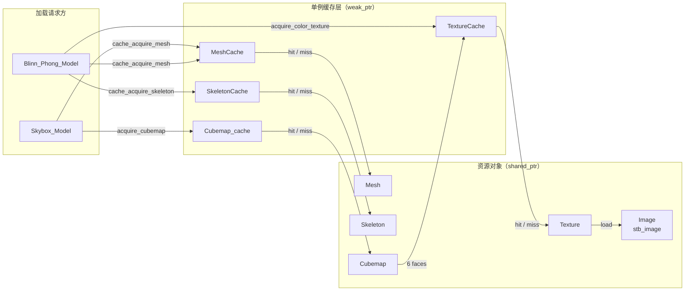

# Renderer 项目架构文档

---

## 1. 模块依赖关系



---

## 2. 类继承与组合关系



---

## 3. 渲染管线数据流



---

## 4. 资源缓存架构



---

## 5. 目录结构速览

```
Renderer/
├── include/
│   ├── core/          ← Application · Scene · Framebuffer · Graphics · Rasterizer
│   ├── geometry/      ← Camera · Model · Mesh · Skeleton · Triangle
│   ├── shading/       ← Shader · Blinn · Skybox · Texture · Light
│   ├── math/          ← mat4_lookat · mat4_orthographic
│   ├── platform/      ← Win32Window
│   └── utils/         ← global · resource_cache · OBJ_Loader
├── src/               ← 对应实现文件（同目录结构）
├── assets/            ← 3D 模型 · 贴图 · 场景描述文件(.scn)
├── TODO.md            ← 技术路线 TODO
└── ARCHITECTURE.md    ← 本文件
```
