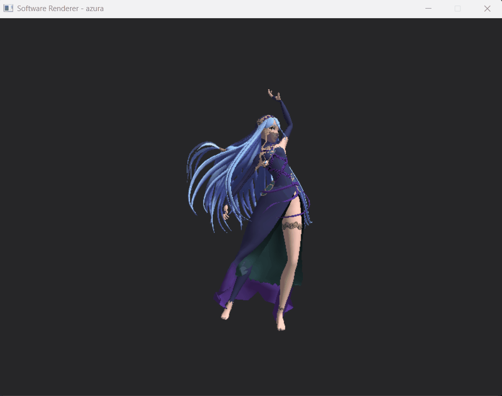
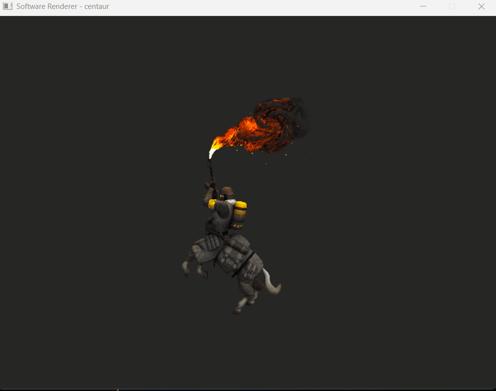
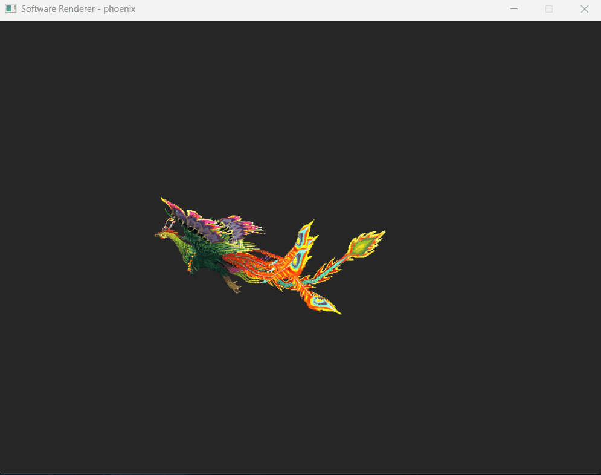

# Software Renderer
本项目为Windows平台下的 C++ 3D 软光栅渲染器。

核心功能与技术实现：
- 完整渲染管线：实现了从模型变换、齐次裁剪、背面剔除、透视校正插值、深度测试到Blinn-Phong光照模型的完整渲染流程。
- 着色技术：实现了切线空间法线贴图以增加表面细节，并集成了阴影贴图以实现动态阴影。
- 动画与交互：集成了骨骼动画系统（顶点蒙皮），并实现了一个环绕式相机（Orbit Camera）用于场景交互。
- 底层架构：使用 Eigen 数学库执行线性代数计算。平台层仿照 GLFW 的接口，自行封装了简单的图形界面、窗口创建和事件循
环。I/O使用 stb_image 库进行纹理和图像文件的加载与处理。

## 参考
主要参考了 C 项目：
https://github.com/zauonlok/renderer

## Screenshots

| Scene                                                                                   | Command                   |
| --------------------------------------------------------------------------------------- | ------------------------- |
|            | `SoftRenderer blinn azura`      |
|        | `SoftRenderer blinn centaur`    |
|   | `SoftRenderer blinn craftsman`  |
|            | `SoftRenderer blinn kgirl`      |
|  | `SoftRenderer blinn lighthouse` |
|        | `SoftRenderer blinn phoenix`    |

## TODO
- pbr实现
- 采样方法改进