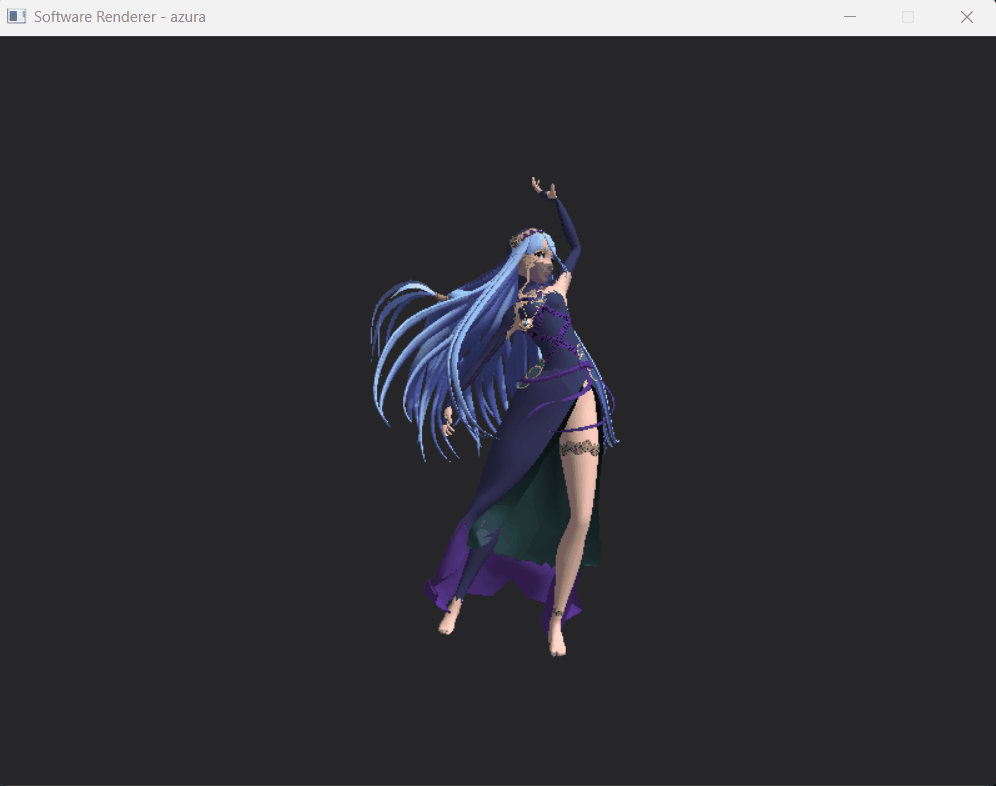
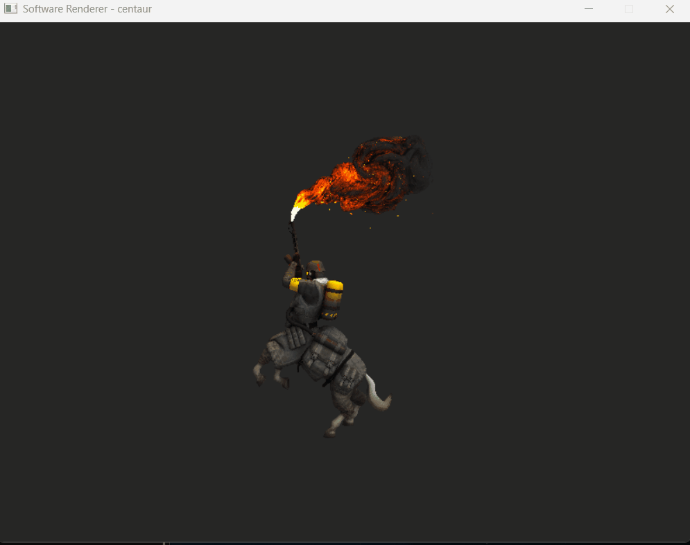
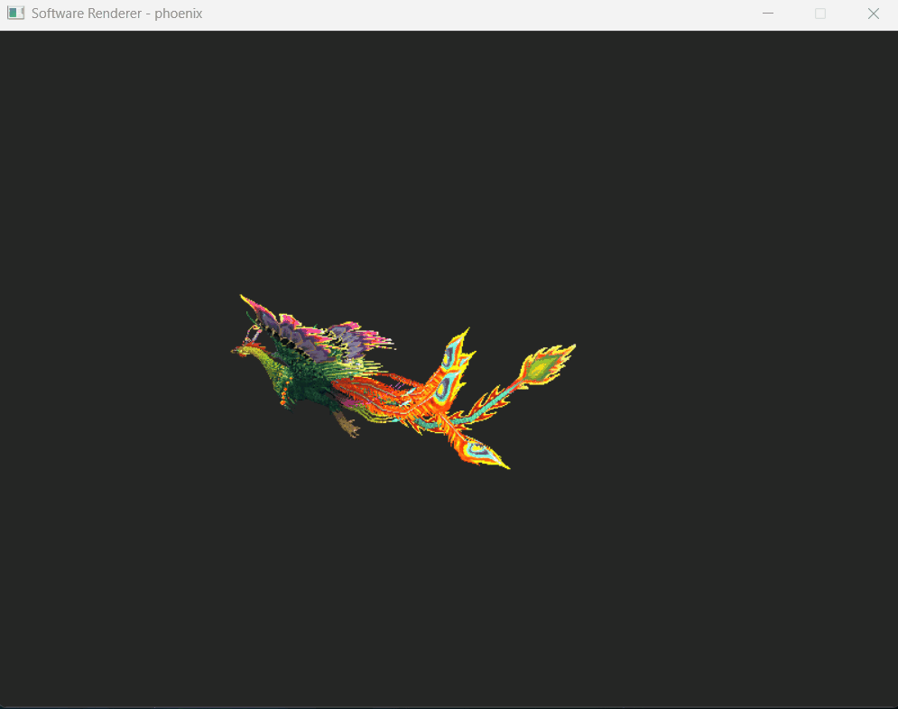

# Software Renderer

本项目为Windows 平台下的 C++ 3D 软光栅渲染器。

## 主要实现

- 软件光栅化管线：实现 Model/View/Projection 变换、齐次裁剪、背面剔除、Top-left 覆盖规则、透视校正插值与深度测试。
- 纹理与着色：支持 Nearest/Bilinear/Trilinear 纹理采样、Mipmap LOD、Blinn–Phong、切线空间法线贴图与 Shadow Mapping。
- 场景与动画：支持 OBJ/`.scn` 加载、Orbit Camera、骨骼层级、关键帧插值与顶点蒙皮。

## 场景

| Azura | Centaur |
| --- | --- |
|  |  |

| Craftsman | Phoenix |
| --- | --- |
|  |  |

| KGirl | Lighthouse |
| --- | --- |
|  |  |

## 构建与运行

### 环境要求

- Windows 10/11
- Visual Studio 2022 或支持 C++17 的 MSVC 工具链
- CMake 3.15+
- vcpkg
- Eigen3、stb

### 配置、编译与测试

```powershell
vcpkg install eigen3:x64-windows stb:x64-windows

cmake -S . -B build `
  -DCMAKE_TOOLCHAIN_FILE="$env:VCPKG_ROOT/scripts/buildsystems/vcpkg.cmake" `
  -DVCPKG_TARGET_TRIPLET=x64-windows

cmake --build build --config Release
```

CMake 会将 `assets/` 自动复制到可执行文件目录。

### 运行示例

```powershell
# Azura 场景
.\build\bin\Release\SoftRenderer.exe azura

# Centaur 场景
.\build\bin\Release\SoftRenderer.exe centaur

# Lighthouse 场景
.\build\bin\Release\SoftRenderer.exe lighthouse
```

```text
SoftRenderer.exe [scene_name]
```

经典场景包括 `azura`、`centaur`、`craftsman`、`phoenix`、`kgirl` 和 `lighthouse`。

### 交互

| 操作 | 功能 |
| --- | --- |
| 鼠标左键拖拽 | Orbit 旋转 |
| 鼠标右键拖拽 | Pan 平移 |
| 鼠标滚轮 | Dolly 推拉 |
| `Space` | 重置相机与光照 |
| `W/A/S/D` | 调整光照方向 |
| `1/2/3` | Nearest / Bilinear / Trilinear |

## 参考

项目早期实现参考了 C 项目 [zauonlok/renderer](https://github.com/zauonlok/renderer)。本项目将其改造为 C++ 工程，并在此基础上做了扩展。
